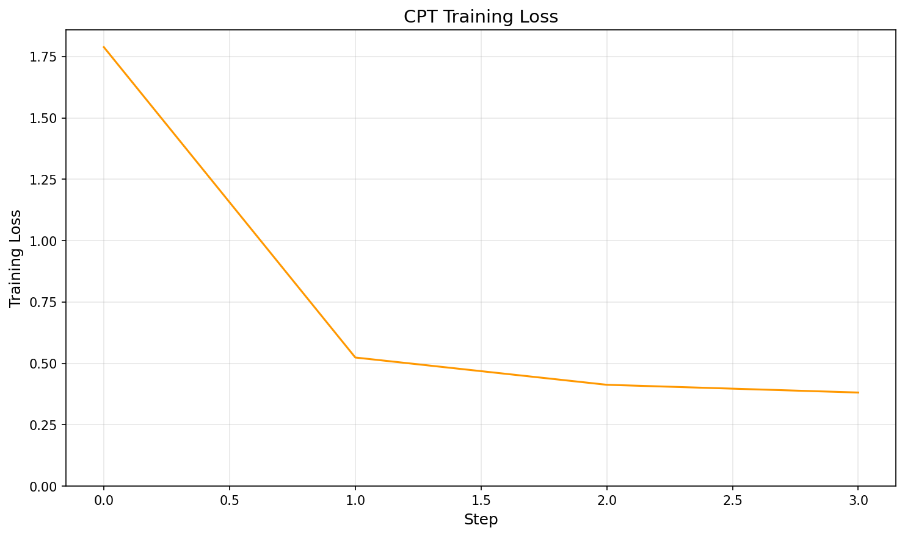
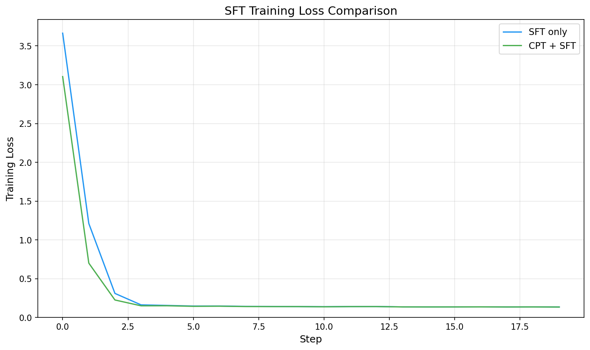
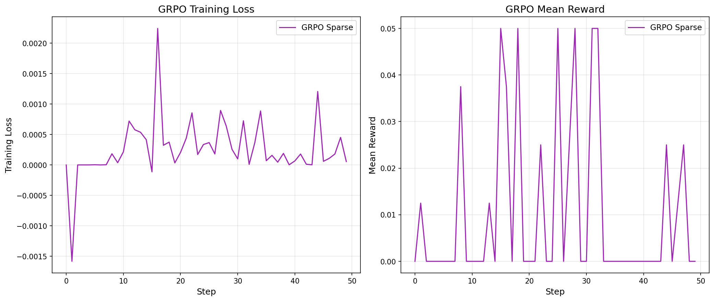
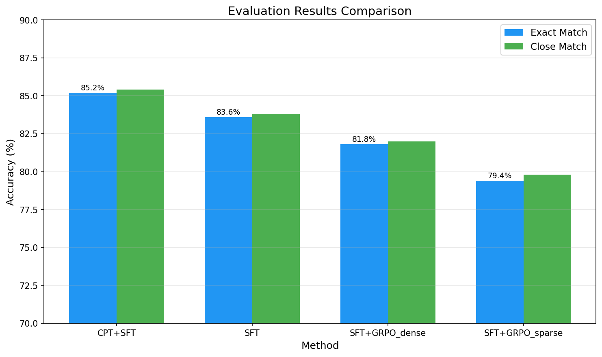
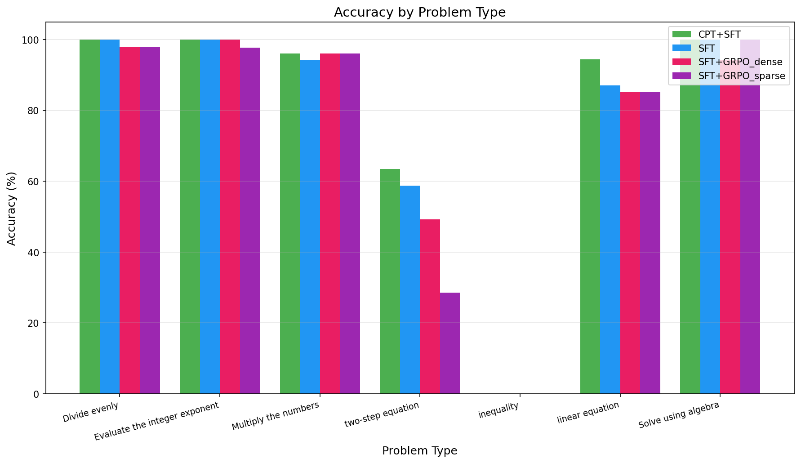

# Experiment Report: Fine-tuning Qwen3-0.6B for Math Reasoning
## Comparing 6 Training Pipelines: CPT+SFT, SFT, GRPO (Dense/Sparse)

---

## 1. Introduction

This report presents results from a comparative study of **six fine-tuning strategies** applied to **Qwen3-0.6B** (600M parameters) for elementary math reasoning tasks. The goal is to determine the most effective training pipeline among:

1. **CPT + SFT** — Continued Pre-Training on domain text, then Supervised Fine-Tuning
2. **SFT only** — Direct Supervised Fine-Tuning from base model
3. **SFT + GRPO (Dense Reward)** — SFT followed by RL with multi-signal reward
4. **SFT + GRPO (Sparse Reward)** — SFT followed by RL with binary correctness reward
5. **CPT + SFT + GRPO (Dense Reward)** — Full pipeline: CPT then SFT then RL with dense reward
6. **CPT + SFT + GRPO (Sparse Reward)** — Full pipeline: CPT then SFT then RL with sparse reward

All experiments use the same dataset split and evaluation protocol for fair comparison.

---

## 2. Dataset

**Source**: `DataMuncher-Labs/LSReasoning-15000` (HuggingFace)

| Property | Value |
|----------|-------|
| Total samples | 15,000 |
| Train split | 12,000 (80%) |
| Test split | 3,000 (20%) |
| Eval subset | 500 samples |
| Split seed | 42 |
| Language | English |

**Problem types**: Arithmetic (addition, subtraction, multiplication, division), linear equations, two-step equations, algebra, fractions, integer exponents, inequalities.

**Fields per sample**: `question`, `problem` (type), `how_to_solve` (approach), `answer` (ground truth).

### 2.1 Data Structure Example

Mỗi sample trong dataset có cấu trúc:

```json
{
  "question": "Solve for x: 3x + 7 = 22",
  "problem": "Solve the linear equation.",
  "how_to_solve": "Subtract 7 from both sides to get 3x = 15, then divide by 3.",
  "answer": "5"
}
```

```json
{
  "question": "What is 48 / 6?",
  "problem": "Divide evenly.",
  "how_to_solve": "Divide 48 by 6.",
  "answer": "8"
}
```

```json
{
  "question": "Reduce 18/24 to simplest form.",
  "problem": "Reduce the fraction to simplest form.",
  "how_to_solve": "Find GCD of 18 and 24, which is 6. Divide both by 6.",
  "answer": "3/4"
}
```

### 2.2 CPT Data Generation

CPT corpus được sinh từ 3 nguồn, tổng ~12,500 passages dạng **plain text** (không có chat template):

**Nguồn 1: Từ training data (~12,000 passages)**

Trích xuất `how_to_solve`, `question`, `answer` và format lại thành đoạn văn tự nhiên:

```text
Problem: Solve for x: 3x + 7 = 22
Solution approach: Subtract 7 from both sides to get 3x = 15, then divide by 3.
The answer is 5.
```

**Nguồn 2: Math theory passages (15 passages)**

Các đoạn lý thuyết toán viết sẵn, bao gồm:
- Arithmetic operations (addition, subtraction, multiplication, division)
- Order of operations (PEMDAS)
- Linear equation solving methods
- Fraction operations (add, subtract, multiply, divide, simplify)
- Word problem translation strategies
- Sign rules for negative numbers

Ví dụ:
```text
A linear equation has the form ax + b = c. To solve: isolate x by performing
inverse operations. Subtract b from both sides, then divide by a.
```

**Nguồn 3: Generated computation examples (500 passages)**

Sinh ngẫu nhiên 500 ví dụ tính toán theo 4 loại:

```text
Computing 25 + 17: the sum equals 42.
```
```text
Solving the equation 5x + 12 = 47: subtract 12 from both sides to get 5x = 35,
then divide by 5 to get x = 7.
```
```text
Simplifying 18/6: the GCD of 18 and 6 is 6, so 18/6 = 3/1.
```
```text
If you buy 7 items at $12 each, the total cost is 7 × $12 = $84.
```

Toàn bộ corpus được shuffle trước khi train, split 95/5 cho train/validation.

---

## 3. Methodology

### 3.1 Base Model

| Property | Value |
|----------|-------|
| Model | Qwen/Qwen3-0.6B |
| Parameters | 600M |
| Architecture | Transformer decoder-only, 28 layers, 14 attention heads |
| Vocabulary size | 151,936 tokens |
| Context length | 32,768 tokens (max), 1024 (used) |
| Quantization | 4-bit QLoRA (NF4, float16 compute) |
| Framework | Unsloth + TRL + PEFT |
| GPU | NVIDIA A10 (24GB VRAM) |

### 3.2 Configuration Comparison (4 Methods)

| Parameter | CPT+SFT | SFT only | SFT+GRPO Dense | SFT+GRPO Sparse |
|-----------|:-------:|:--------:|:--------------:|:---------------:|
| **Stage 1** | CPT | - | - | - |
| Data | ~12,500 plain text | - | - | - |
| Epochs | 2 | - | - | - |
| LR | 2e-4 | - | - | - |
| LoRA r/alpha | 16/32 | - | - | - |
| **Stage 2** | SFT | SFT | SFT | SFT |
| Base model | CPT merged | Qwen3-0.6B | Qwen3-0.6B | Qwen3-0.6B |
| Data | 12,000 chat pairs | 12,000 chat pairs | 12,000 chat pairs | 12,000 chat pairs |
| Epochs | 3 | 3 | 3 | 3 |
| LR | 1e-4 | 1e-4 | 1e-4 | 1e-4 |
| LoRA r/alpha | 32/64 | 32/64 | 32/64 | 32/64 |
| Batch size (eff.) | 16 | 16 | 16 | 16 |
| **Stage 3** | - | - | GRPO | GRPO |
| Base model | - | - | SFT merged | SFT merged |
| Prompts | - | - | 1,000 | 1,000 |
| Generations/prompt | - | - | 4 | 4 |
| Reward | - | - | Dense (4 signals) | Sparse (binary) |
| Epochs | - | - | 1 | 1 |
| LR | - | - | 5e-6 | 5e-6 |
| LoRA r/alpha | - | - | 16/32 | 16/32 |
| KL beta | - | - | 0.1 | 0.1 |
| Batch size (eff.) | - | - | 8 | 8 |
| **Common** | | | | |
| Optimizer | adamw_8bit | adamw_8bit | adamw_8bit | adamw_8bit |
| LR scheduler | cosine | cosine | cosine | cosine |
| Warmup ratio | 0.1 | 0.1 | 0.1 | 0.1 |
| Weight decay | 0.01 | 0.01 | 0.01 | 0.01 |
| Max seq length | 1024 | 1024 | 1024 | 1024 |
| Precision | fp16 | fp16 | fp16 | fp16 |
| Quantization | 4-bit QLoRA | 4-bit QLoRA | 4-bit QLoRA | 4-bit QLoRA |

### 3.3 Training Stages (Detail)

#### CPT (Continued Pre-Training)

Adapts the base model to the math domain using plain text (no instruction format).

| Hyperparameter | Value |
|----------------|-------|
| Corpus size | ~12,500 passages |
| Epochs | 2 |
| Learning rate | 2e-4 |
| Effective batch size | 16 |
| LoRA r / alpha | 16 / 32 |
| Max seq length | 1024 |
| Packing | Yes |

**Corpus composition**:
- ~12,000 passages derived from training data (`how_to_solve` + question + answer)
- 15 curated math theory passages (arithmetic, algebra, fractions, word problems)
- 500 programmatically generated computation examples

#### SFT (Supervised Fine-Tuning)

Trains the model to follow instructions using chat-formatted conversations.

| Hyperparameter | Value |
|----------------|-------|
| Training samples | 12,000 |
| Epochs | 3 |
| Learning rate | 1e-4 |
| Effective batch size | 16 |
| LoRA r / alpha | 32 / 64 |
| LoRA dropout | 0.05 |
| Max seq length | 1024 |
| Packing | Yes |
| Early stopping | Best eval_loss |

**Chat template**:
```
System: You are a math tutor. Solve the problem step by step, show your reasoning clearly, then give the final answer.
User: {question}
Assistant: Approach: {how_to_solve}
Solving step by step:
{question}
Answer: {answer}
```

#### GRPO (Group Relative Policy Optimization)

Reinforcement learning stage that generates multiple completions per prompt and updates based on relative reward.

| Hyperparameter | Value |
|----------------|-------|
| Training prompts | 1,000 |
| Generations per prompt | 4 |
| Epochs | 1 |
| Learning rate | 5e-6 |
| Effective batch size | 8 |
| KL penalty (beta) | 0.1 |
| LoRA r / alpha | 16 / 32 |
| Max completion length | 256 |

### 3.4 Reward Functions

#### Dense Reward (Multi-Signal)

```
R_dense = 0.4 × R_correctness + 0.2 × R_proximity + 0.2 × R_format + 0.2 × R_reasoning
```

**R_correctness** (binary):
```
R_correctness = 1.0  if |predicted - true| < 1e-6
                0.0  otherwise
```
Trích xuất số từ response bằng regex: tìm pattern `Answer: <number>`, fallback lấy số cuối cùng. Hỗ trợ int, float, fraction (`3/4` → 0.75).

**R_proximity** (continuous):
```
R_proximity = 1.0                                      if exact match
              max(0, 1 - |predicted|)                  if true = 0
              max(0, 1 - |predicted - true| / max(|true|, 1))   otherwise
```
Partial credit dựa trên relative error — đáp án gần đúng vẫn nhận reward.

**R_format** (additive, cap 1.0):
```
R_format  = +0.3  if "Answer:" or "answer:" in response
            +0.3  if response has >= 3 non-empty lines
            +0.2  if contains reasoning words ("step", "solve", "approach", "therefore", "thus")
            +0.2  if contains math operators (=, +, -, *, /)
```

**R_reasoning** (additive, cap 1.0):
```
R_reasoning = +0.15 per keyword match with how_to_solve (max +0.5)
              +0.3  if response contains math operators
              +0.2  if response contains numeric computation pattern (e.g. "3x = 15")
```
Chỉ count keyword > 3 ký tự để tránh noise từ stopwords.

#### Sparse Reward (Binary)

```
R_sparse = R_correctness (0 or 1)
```

Chỉ dùng đúng/sai, không partial credit, không reward format hay reasoning.

#### Ví dụ so sánh Dense vs Sparse

Câu hỏi: `3x + 7 = 22`, đáp án đúng: `5`

**Case 1** — Model trả lời đúng + có reasoning:
```
"Step 1: subtract 7 from both sides
3x = 15
Divide by 3
Answer: 5"
```

| Component | Score |
|-----------|:-----:|
| Correctness | 1.0 |
| Proximity | 1.0 |
| Format | 1.0 |
| Reasoning | 0.8 |
| **R_dense** | **0.96** |
| **R_sparse** | **1.0** |

**Case 2** — Model trả lời sai nhưng gần đúng:
```
"Answer: 4"
```

| Component | Score |
|-----------|:-----:|
| Correctness | 0.0 |
| Proximity | 0.8 |
| Format | 0.3 |
| Reasoning | 0.0 |
| **R_dense** | **0.22** |
| **R_sparse** | **0.0** |

Dense reward cho gradient signal (0.22) ngay cả khi sai → model biết đang đi đúng hướng. Sparse cho 0 → model không phân biệt được sai xa hay sai gần.

### 3.5 Design Patterns

- **Decreasing learning rate** across stages: CPT (2e-4) > SFT (1e-4) > GRPO (5e-6)
- **Decreasing LoRA rank** for later stages: SFT (r=32) > CPT/GRPO (r=16)
- **Model merging** between stages: LoRA adapters merged to float16 before next stage
- **Consistent dtype**: All stages use float16 to avoid Half/BFloat16 conflicts with 4-bit dequantization

### 3.6 Evaluation Protocol

#### Inference Setup

| Parameter | Value |
|-----------|-------|
| Test set | 500 samples (from 20% holdout) |
| Batch size | 16 |
| Max new tokens | 256 |
| Decoding | Greedy (do_sample=False) |
| Quantization | 4-bit (same as training) |

#### Metrics

**Exact Match**: Trích xuất số từ output model, so sánh với ground truth.

Logic trích xuất:
1. Tìm pattern `Answer: <number>` trong response
2. Nếu không có, lấy số cuối cùng trong response
3. Hỗ trợ số nguyên, thập phân, phân số (ví dụ `3/4` → 0.75)
4. So sánh: `|predicted - true| < 1e-6` → exact match

**Close Match**: Tương tự Exact Match nhưng cho phép sai số 1%:
- `|predicted - true| / |true| < 0.01` → close match

**Format Score**: Tỷ lệ response có chứa "Answer:" hoặc "answer:" — đánh giá model có tuân thủ format output không.

**Reasoning Score**: Tỷ lệ response có ≥ 3 dòng non-empty — đánh giá model có show reasoning steps không.

#### Example Evaluation Flow

```
Input:  "Solve for x: 5x - 3 = 12"
Output: "Approach: Add 3 to both sides, then divide by 5.
         Solving step by step:
         5x - 3 = 12
         5x = 15
         x = 3
         Answer: 3"

Extract number: 3
Ground truth: 3
|3 - 3| < 1e-6 → Exact Match ✓
Contains "Answer:" → Format ✓
≥ 3 lines → Reasoning ✓
```

#### Batch Inference

Evaluation sử dụng **batch inference** (batch_size=16) thay vì sequential generation:
- Left-padding với pad_token = eos_token
- `torch.no_grad()` để giảm memory
- Progress log mỗi 5 batches
- ~500 samples hoàn thành trong ~5 phút trên A10

---

## 4. Training Curves

### 4.1 CPT Training Loss



CPT loss giảm nhanh trong 2 epochs trên domain text — model nhanh chóng absorb math vocabulary và patterns.

### 4.2 SFT Training Loss



So sánh SFT loss giữa 2 pipelines:
- **CPT+SFT** (green): Bắt đầu từ CPT checkpoint, loss khởi đầu thấp hơn do đã adapted domain
- **SFT only** (blue): Bắt đầu từ base model, loss khởi đầu cao hơn

### 4.3 GRPO Training Loss & Reward



- **Left**: GRPO training loss cho Dense vs Sparse reward
- **Right**: Mean reward progression — Dense reward cung cấp gradient phong phú hơn, reward tăng nhanh hơn

---

## 5. Results

### 5.1 Overall Performance

| Method | Exact Match | Close Match | Format | Reasoning |
|--------|:-----------:|:-----------:|:------:|:---------:|
| **CPT + SFT** | **85.2%** | **85.4%** | 100% | 100% |
| SFT only | 83.6% | 83.8% | 100% | 100% |
| SFT + GRPO (dense) | 81.8% | 82.0% | 100% | 100% |
| CPT + SFT + GRPO (dense) | 80.4% | 80.4% | 100% | 100% |
| SFT + GRPO (sparse) | 79.4% | 79.8% | 100% | 100% |
| CPT + SFT + GRPO (sparse) | 78.4% | 78.4% | 100% | 100% |

**Winner: CPT + SFT** with 85.2% exact match, outperforming all other methods including the full 3-stage pipeline.



### 5.2 Performance by Problem Type



| Problem Type | CPT+SFT | SFT | SFT+GRPO Dense | SFT+GRPO Sparse | CPT+SFT+GRPO Dense | CPT+SFT+GRPO Sparse |
|-------------|:-------:|:---:|:--------------:|:---------------:|:------------------:|:-------------------:|
| Add two numbers | 100% | 100% | 100% | 100% | 100% | 100% |
| Subtract numbers | 100% | 100% | 100% | 100% | 100% | 100% |
| Multiply numbers | 96.1% | 94.1% | 96.1% | 96.1% | 92.2% | 92.2% |
| Divide evenly | 100% | 100% | 97.8% | 97.8% | 100% | 100% |
| Reduce fractions | 100% | 100% | 100% | 100% | 100% | 100% |
| Integer exponents | 100% | 100% | 100% | 97.7% | 100% | 100% |
| Linear equations | **94.4%** | 87.0% | 85.2% | 85.2% | 72.2% | 63.0% |
| Two-step equations | **63.5%** | 58.7% | 49.2% | 28.6% | 49.2% | 39.7% |
| Solve using algebra | 100% | 100% | 94.1% | 100% | 97.1% | 100% |
| Solve inequalities | 0% | 0% | 0% | 0% | 0% | 0% |

### 5.3 Key Observations

**1. CPT + SFT is the best method — GRPO consistently degrades performance**

| Ranking | Method | Exact Match | Delta vs CPT+SFT |
|:-------:|--------|:-----------:|:-----------------:|
| 1 | CPT + SFT | 85.2% | baseline |
| 2 | SFT only | 83.6% | -1.6% |
| 3 | SFT + GRPO (dense) | 81.8% | -3.4% |
| 4 | CPT + SFT + GRPO (dense) | 80.4% | -4.8% |
| 5 | SFT + GRPO (sparse) | 79.4% | -5.8% |
| 6 | CPT + SFT + GRPO (sparse) | 78.4% | -6.8% |

The continued pre-training stage provides domain adaptation that improves downstream fine-tuning. The gains are most pronounced on complex problem types:
- Linear equations: CPT+SFT 94.4% vs SFT 87.0% (+7.4%)
- Two-step equations: CPT+SFT 63.5% vs SFT 58.7% (+4.8%)

**2. GRPO always hurts performance regardless of base model**

Adding GRPO on top of any model (SFT or CPT+SFT) consistently reduces accuracy:
- SFT → SFT+GRPO dense: 83.6% → 81.8% (-1.8%)
- SFT → SFT+GRPO sparse: 83.6% → 79.4% (-4.2%)
- CPT+SFT → CPT+SFT+GRPO dense: 85.2% → 80.4% (-4.8%)
- CPT+SFT → CPT+SFT+GRPO sparse: 85.2% → 78.4% (-6.8%)

GRPO causes more damage to CPT+SFT (-4.8%/-6.8%) than to SFT alone (-1.8%/-4.2%), suggesting that the better the base model, the more RL exploration disrupts learned knowledge.

**3. Dense reward > Sparse reward (consistent across both base models)**

| Base Model | Dense | Sparse | Gap |
|-----------|:-----:|:------:|:---:|
| SFT | 81.8% | 79.4% | +2.4% |
| CPT+SFT | 80.4% | 78.4% | +2.0% |

Dense reward consistently outperforms sparse by ~2% — the partial credit signals (proximity, format, reasoning) provide better gradient than binary correctness alone.

**4. Two-step equations and linear equations are the key differentiators**

These complex types show the clearest separation between methods:

Two-step equations: CPT+SFT (63.5%) > SFT (58.7%) > SFT+GRPO dense = CPT+SFT+GRPO dense (49.2%) > CPT+SFT+GRPO sparse (39.7%) > SFT+GRPO sparse (28.6%)

Linear equations: CPT+SFT (94.4%) > SFT (87.0%) > SFT+GRPO dense/sparse (85.2%) > CPT+SFT+GRPO dense (72.2%) > CPT+SFT+GRPO sparse (63.0%)

GRPO sparse catastrophically degrades on multi-step reasoning — the binary reward provides no learning signal for partial progress.

**5. Format and reasoning are saturated**

All 6 methods achieve 100% format and reasoning scores, indicating that even basic SFT is sufficient to teach output structure for this dataset.

**6. Inequalities remain unsolved**

All methods score 0% on inequalities — this problem type likely requires fundamentally different reasoning patterns not present in the training data.

---

## 6. Analysis: Why GRPO Underperforms

The GRPO results contradict findings from larger-scale RL papers. With 6 experiments confirming the pattern, several factors explain this:

### 6.1 Small Model Capacity (0.6B)

A 600M parameter model has limited capacity for the explore-exploit trade-off in RL. GRPO requires generating diverse completions to discover better solutions, but a small model may not have sufficient representational power to benefit from this.

### 6.2 Already-High SFT Baseline

The SFT model already achieves 83.6% (CPT+SFT: 85.2%) — most "easy" problems are solved. GRPO's exploration primarily affects the remaining hard problems, but the generation quality for these problems may be too poor to provide meaningful reward signal.

### 6.3 GRPO Causes "Catastrophic Forgetting" of Learned Knowledge

The strongest evidence: CPT+SFT+GRPO dense drops linear equations from 94.4% to 72.2% (−22.2%). The RL phase actively unlearns knowledge acquired during CPT+SFT, particularly for problem types requiring precise multi-step reasoning.

The better the base model (CPT+SFT > SFT), the more GRPO damages it:
- GRPO on SFT: −1.8% (dense), −4.2% (sparse)
- GRPO on CPT+SFT: −4.8% (dense), −6.8% (sparse)

This suggests GRPO's reward-based exploration disrupts fine-grained reasoning patterns that supervised learning established.

### 6.4 Limited GRPO Training Budget (1000 prompts)

With only 1000 prompts × 4 generations × 1 epoch, the RL stage may not have sufficient training signal to improve. The model is "unlearning" SFT knowledge faster than it can discover improvements through exploration.

### 6.5 Reward Function Limitations

The dense reward's proximity and reasoning components may introduce noise. For example, a wrong answer that is numerically close to the correct one receives partial credit, potentially reinforcing incorrect reasoning paths. Even dense reward cannot prevent the overall degradation — it only mitigates it (~2% better than sparse).

### 6.6 Summary: What Each Stage Actually Does

| Stage | Effect on 0.6B Model | Evidence |
|-------|---------------------|----------|
| **CPT** | Injects math vocabulary & patterns into base weights | CPT+SFT (85.2%) > SFT (83.6%) on same data |
| **SFT** | Teaches instruction following + structured output | 83.6% from base, 100% format compliance |
| **GRPO** | Explores alternative solutions via reward signal | −1.8% to −6.8% degradation across all variants |

The core issue: at 0.6B scale, the model's capacity is a **zero-sum game**. GRPO's exploration forces the model to allocate capacity to reward-hacking strategies (producing answers that score well on proximity/format) at the expense of precise reasoning learned during SFT.

### 6.7 Practical Interpretation

The 6 experiments paint a clear picture of how training pipeline depth interacts with model scale:

```
Accuracy vs Pipeline Depth (Qwen3-0.6B):

  85.2% ─── CPT+SFT ●
  83.6% ─── SFT ●
  81.8% ─── SFT+GRPO(dense) ●
  80.4% ─── CPT+SFT+GRPO(dense) ●
  79.4% ─── SFT+GRPO(sparse) ●
  78.4% ─── CPT+SFT+GRPO(sparse) ●

  More stages ≠ Better results (at this scale)
```

**Why CPT helps but GRPO hurts:**
- CPT is **additive** — it adds domain knowledge without conflicting with later SFT training
- GRPO is **adversarial** — it actively modifies weights to maximize reward, which can override SFT-learned patterns
- At 0.6B parameters, the model cannot simultaneously maintain SFT knowledge AND incorporate RL updates

**Why dense > sparse (but both still hurt):**
- Dense reward gives gradient signal even for wrong answers → smoother optimization → less catastrophic forgetting
- Sparse reward only gives signal on exact matches → noisy gradients → more aggressive weight updates → more forgetting

---

## 7. Inference Optimization

### KV Cache Benchmark

Tested on the best model (CPT+SFT) with 50 samples, batch_size=8:

| Strategy | Time (s) | Throughput (tok/s) | Speedup |
|----------|:--------:|:-----------------:|:-------:|
| Dynamic KV Cache (baseline) | 17.53 | 730.1 | 1.00x |
| Static KV Cache | 16.80 | 761.7 | **1.04x** |

The Static KV Cache provides a modest 4% speedup by pre-allocating cache memory and avoiding dynamic reallocation overhead. The improvement is relatively small because:
- The 0.6B model has a small KV cache to begin with
- Batch inference already amortizes overhead effectively
- The bottleneck is generation (autoregressive decoding), not cache management

For production deployment, additional optimizations to consider:
- **torch.compile**: JIT compilation of forward pass (additional 10-20% speedup after warmup)
- **vLLM/TGI**: Dedicated serving frameworks with continuous batching
- **Quantized inference**: INT8/INT4 without LoRA overhead (merge weights permanently)

---

## 8. Conclusions & Recommendations

### Key Findings

1. **CPT + SFT is the most effective pipeline** (85.2%) for adapting a small LLM to a specific math domain. Domain pre-training on plain text passages before instruction tuning provides measurable gains (+1.6% over SFT, +7.4% on linear equations).

2. **GRPO consistently degrades performance** regardless of base model. All 4 GRPO variants (dense/sparse × SFT/CPT+SFT) scored lower than their respective base models. The full 3-stage pipeline (CPT+SFT+GRPO) is the worst-performing CPT variant.

3. **The better the base model, the more GRPO hurts it**. GRPO on CPT+SFT causes −4.8% to −6.8% degradation vs −1.8% to −4.2% on SFT alone. RL exploration is more destructive when there is more learned knowledge to lose.

4. **Dense reward > Sparse reward** consistently (~2% gap), but neither can prevent overall degradation from RL at this scale.

5. **Output format is trivially learned** — all 6 methods achieve 100% format/reasoning scores after SFT.

### Recommended Pipeline

For production deployment of Qwen3-0.6B on math reasoning:

```
Qwen3-0.6B → CPT (2 epochs, 2e-4 LR) → SFT (3 epochs, 1e-4 LR)
```

**Do NOT add GRPO** at this scale. The 2-stage pipeline outperforms all 3-stage variants.

### When GRPO Might Help

- Model size >= 7B (more capacity for exploration)
- SFT baseline < 70% (more room for RL to improve)
- GRPO budget > 5000 prompts with multiple epochs
- Tasks where format diversity matters (not saturated by SFT)

### Future Work

- Increase GRPO budget (5000+ prompts, 2-3 epochs) to test if longer training overcomes forgetting
- Try DPO (Direct Preference Optimization) as a less destructive RL alternative
- Scale to larger models (Qwen3-1.7B, 4B) where GRPO may finally help
- Add KL divergence constraint tuning (lower beta) to reduce forgetting
- Address inequality solving with targeted data augmentation

---

## 9. Reproducibility

### Environment

| Component | Version |
|-----------|---------|
| GPU | NVIDIA A10 (24GB) |
| Framework | Unsloth + TRL |
| Model | Qwen/Qwen3-0.6B |
| Quantization | 4-bit QLoRA (float16) |
| Python | 3.10 |

### Commands

```bash
# Full experiment (4 methods)
python scripts/run_experiment_lsreasoning.py

# Individual steps
python scripts/train_cpt_lsreasoning.py --train-file data/lsreasoning_split/train.jsonl
python scripts/train_sft_lsreasoning_v2.py --train-file data/lsreasoning_split/train.jsonl
python scripts/train_grpo_lsreasoning_v2.py --reward-mode dense --sft-path outputs/sft_lsreasoning/final
python scripts/evaluate_lsreasoning_v2.py --model-path outputs/cpt_sft_lsreasoning/final --test-file data/lsreasoning_split/test.jsonl

# Inference benchmark
python scripts/inference_optimized.py --model-path outputs/cpt_sft_lsreasoning/final --benchmark
```

### Tracking

- **wandb project**: [lsreasoning-sft-vs-grpo](https://wandb.ai/hiep26-sdf/lsreasoning-sft-vs-grpo)
- **Data split**: `data/lsreasoning_split/` (seed=42, 80/20)
- **Results**: `outputs/experiment_results.json`

---

## Appendix: Training Time

| Stage | Duration (est.) |
|-------|:---------:|
| CPT | ~15 min |
| SFT (CPT+SFT) | ~30 min |
| SFT (standalone) | ~30 min |
| GRPO dense (1000 prompts) | ~15 min |
| GRPO sparse (1000 prompts) | ~15 min |
| Evaluation (4 models × 500 samples) | ~20 min |
| **Total** | **~2 hours** |
